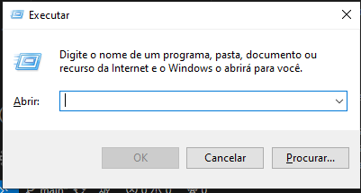
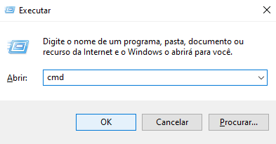
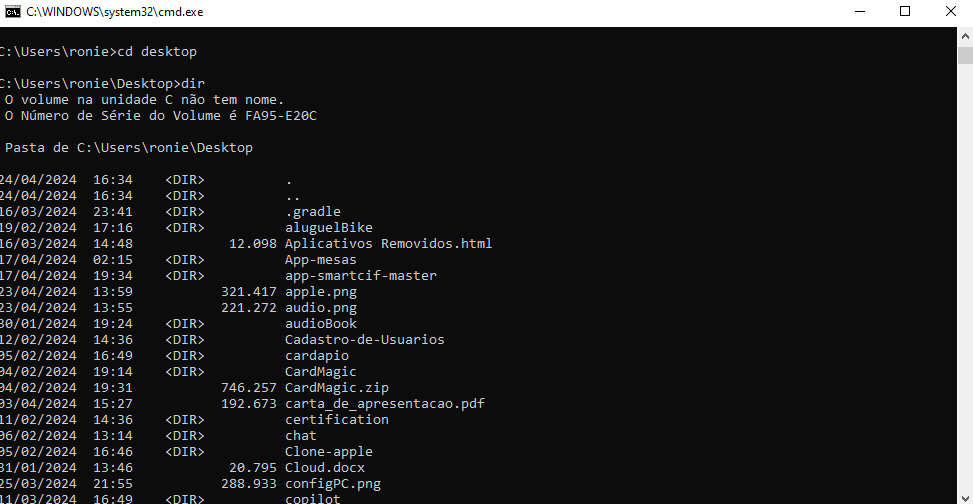
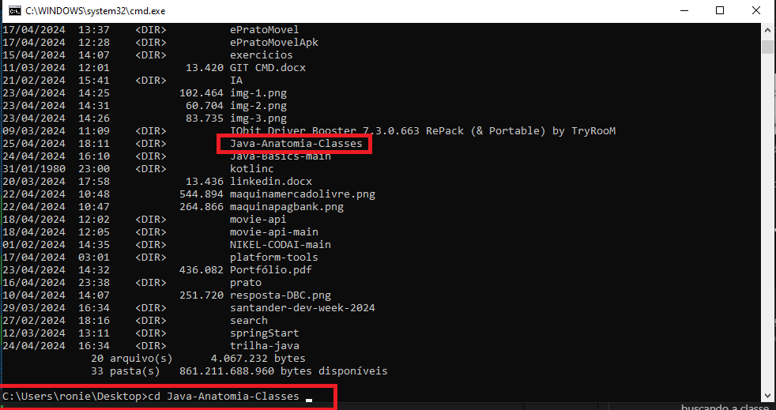
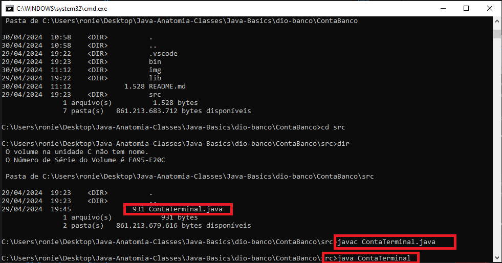
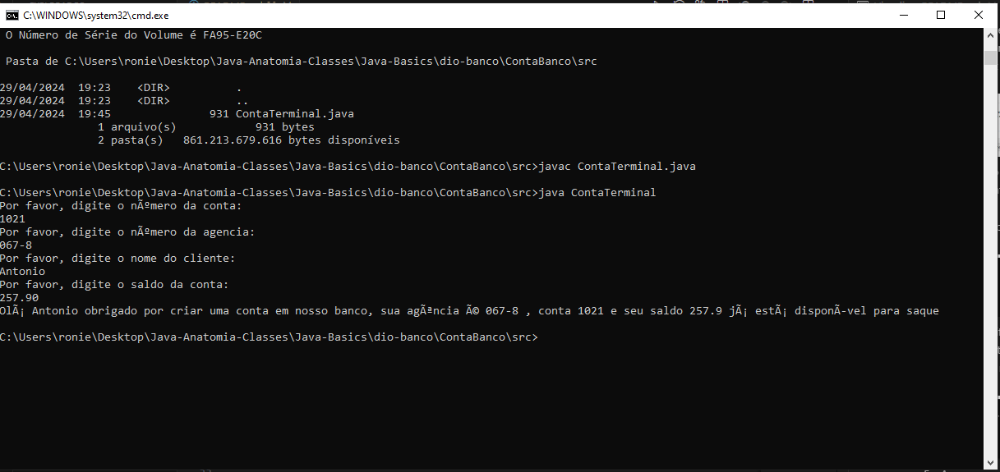

## OverView

Já pensou em executar um arquivo java diretamente do terminal? então.... agora é possível.
Depois de já ter declarado todas as variáveis e criando o método main. Vou mostra como é simples executar o código deste repositorio direto do prompt comando.

## Executando o Código
<ul>
    <li>
        1 - Primeiro pressione as teclas   + R, assim vai aparecer a caixa de pesquisa:          
        

              
        

    </li>
    <li>
         2 - digite cmd e pressione enter para abrir o prompt de comando:
         

         
         

    </li>
    <li>
         3 - Após abri o cmd, digite o seguinte comando dir e procure pelo diretório do projeto:
         
    </li>
    <li>
         4 - Após identificar a pasta do projeto digite cd seguido do nome identificado:
         
    </li>
    <li>
         5 - Agora navegue entre os diretorios buscando a classe ContaTerminal.java e execute o seguinte comando: javac ContaTerminal.java e logo após execute java ContaTerminal:
         
    </li>
    <li>
         7 - Com isso, a classe será iniciada e todas as perguntas serão apresentadas para o usuário:
         
    </li>

</ul>

## Consideração Final

Neste pequeno projeto podemos entender que é poss[ivel executar através do cmd um arquivo java. Sem precisa de uma IDE ou até mesmo de um editor de código
